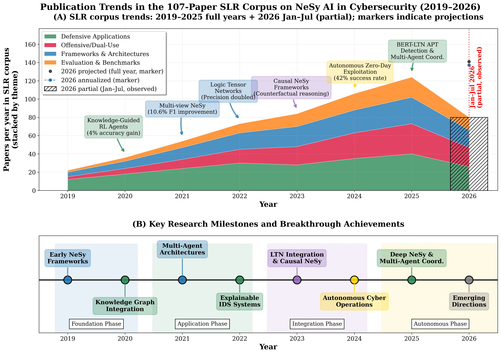

# Neuro-Symbolic AI for Cybersecurity: State of the Art, Challenges, and Opportunities

**Supplementary Repository for the Paper** ([arXiv:2509.06921](https://arxiv.org/abs/2509.06921))

## Overview

This repository accompanies the paper *Neuro-Symbolic AI for Cybersecurity: State of the Art, Challenges, and Opportunities*. It brings together the structured supplementary materials supporting the paper's synthesis of **108 publications** across the neural-symbolic integration spectrum in cybersecurity, covering the period from January 2019 through July 2026. These materials include the curated paper catalog, representative G-I-A assessments, and lightweight analysis utilities intended to support closer inspection of the survey corpus and its classification.

The repository is intended as a supplementary scholarly artifact for readers of the paper. It is designed to improve transparency, traceability, and inspection of the underlying survey materials, rather than to serve as a full experimental reproduction package.



## Scope

The survey adopts a three-tier taxonomy designed to make integration depth explicit while preserving the breadth of the cybersecurity literature relevant to the paper's analysis.

### Three-Tier Integration Taxonomy

| Tier | Name | Papers | Description |
|------|------|--------|-------------|
| **Type A** | Deep NeSy | 22 | Joint optimization or deeply interleaved neural-symbolic training (e.g., LTN-based IDS, differentiable logic in GNNs) |
| **Type B** | Structured neural-symbolic systems | 59 | Meaningful interaction between neural and symbolic components (e.g., KG-guided learning, LLM + formal tools, causal-neural integration); distinct from strict end-to-end Type A integration |
| **Type C** | Contextual Baselines | 27 | Pure neural/statistical systems included for comparative context |

### G-I-A Analytical Lens

The Grounding-Instructibility-Alignment (G-I-A) analytical lens supports structured examination of NeSy cybersecurity systems across three dimensions:

- **Grounding (G):** How well the system establishes meaningful connections between outputs and cybersecurity concepts
- **Instructibility (I):** How effectively the system responds to analyst feedback and guidance
- **Alignment (A):** How consistently the system operates in accordance with organizational cybersecurity objectives

The G-I-A assessments included in this repository are author-assessed qualitative observations used for analytical illustration. They are not validated benchmark measurements, rankings, production scoring outputs, or numerical aggregates.

## Repository Structure

```
.
├── README.md                        # This file
├── CITATION.cff                     # Citation metadata
├── requirements.txt                 # Python dependencies for utilities and notebook
├── data/
│   ├── paper_catalog.csv            # All 108 surveyed papers with classification
│   └── gia_scores.csv               # Qualitative G-I-A assessments for representative systems
├── docs/
│   └── review_protocol.md            # Search, selection, and classification protocol
├── figures/
│   └── nesy_evolution.png           # Publication trends and milestone overview from the paper
├── notebooks/
│   └── gia_framework_demo.ipynb     # Qualitative G-I-A analytical-lens walkthrough
└── scripts/
    └── catalog_analysis.py          # Analysis utilities for the paper catalog
```

## Data

### [Review Protocol and Traceability Notes](docs/review_protocol.md)

The review protocol records the search concept blocks, sources, selection stages, inclusion/exclusion criteria, double-coding checks, and Type A/B/C classification rule. It also explains the scope of the supplementary artifact: the final catalog is fully inspectable, while intermediate proprietary-index result sets and individual exclusion logs are not redistributed.

### [Paper Catalog](data/paper_catalog.csv)

Complete per-paper classification for all 108 surveyed publications:
- **Citation key** and full reference
- **Integration tier** (A/B/C) with subtype for Type B
- **Neural component** description
- **Symbolic component** description
- **Application domain**

Schema:

| Column | Meaning |
|--------|---------|
| `id` | Stable survey identifier (`A1`--`A22`, `B1`--`B59`, `C1`--`C27`) |
| `citation_key` | BibTeX key aligned with the manuscript bibliography |
| `authors` | Short-form author string |
| `year` | Publication year |
| `tier` | Integration tier (`A`, `B`, or `C`) |
| `subtype` | Subtype label, primarily for Type B papers |
| `neural_component` | Short description of the neural or sub-symbolic component |
| `symbolic_component` | Short description of the symbolic or structured component |
| `domain` | Primary cybersecurity application domain |
| `venue_type` | Venue category (e.g., conference, journal, book) |

### [G-I-A Qualitative Assessments](data/gia_scores.csv)

G-I-A analytical-lens assessments for representative systems from Table 2 of the paper, including methodology notes. Strong, Moderate, and Limited are author-assessed qualitative observations based on published system descriptions; they are not measured values or rankings.

Schema:

| Column | Meaning |
|--------|---------|
| `system` | System name used in the manuscript |
| `citation_key` | BibTeX key aligned with the manuscript bibliography |
| `tier` | Integration tier (`A`, `B`, or `C`) |
| `grounding_assessment` | Author-assessed qualitative grounding assessment |
| `instructibility_assessment` | Author-assessed qualitative instructibility assessment |
| `alignment_assessment` | Author-assessed qualitative alignment assessment |
| `key_metric` | Representative performance metric reported in the paper |
| `metric_value` | Metric value as reported in the paper |
| `notes` | Brief justification for the qualitative assessment |

## Supplementary Notebook

The Jupyter notebook [notebooks/gia_framework_demo.ipynb](notebooks/gia_framework_demo.ipynb) provides an illustrative walkthrough of:
1. How each G-I-A dimension is conceptually defined
2. How a qualitative assessment record can document supporting evidence
3. How the representative categorical assessments in Table 2 can be inspected

The notebook does not compute numerical G-I-A scores, rank systems, or estimate tier-level effects. See the paper for detailed discussion of G-I-A's role as an analytical lens.

## Running the Utilities

From the repository root:

```bash
python -m venv .venv
source .venv/bin/activate
python -m pip install -r requirements.txt
python scripts/catalog_analysis.py
```

Use `--plot` to generate a local corpus-overview figure and `--export` to generate local summary CSVs. These derived outputs are intentionally ignored by Git because they can be recreated from `data/paper_catalog.csv`.

## Selected Findings

- In reviewed task-specific comparisons, some structured-integration and multi-agent systems report gains over selected single-agent baselines
- Causal reasoning can support counterfactual defensive analysis beyond correlation-based detection
- Knowledge-guided learning can support data efficiency and explainability in suitable task settings
- Autonomous offensive systems in the broader survey corpus achieve notable zero-day exploitation success at significantly reduced cost, highlighting important dual-use implications for the field
- Critical evaluation standardization gaps remain (0% coverage for causal reasoning, multi-agent testing)

## Related Surveys

- Bizzarri et al. (2025) -- NeSy approaches for NIDS using Logic Tensor Networks (deeper LTN-specific focus)
- Shama et al. (2026) -- Scientometric analysis of the NeSy cybersecurity landscape
- Colelough & Regli (2025) -- NeSy AI as a distinct paradigm for cybersecurity

## Interpretation Notes

- Type C entries are contextual baselines included to support comparative analysis; they are not presented as strict NeSy exemplars.
- The repository follows the final survey taxonomy and supplementary classification tables accompanying the manuscript.
- The materials here are intended to support traceability, inspection, and scholarly reuse of the survey's structured artifacts.

## License

This repository is provided for research and educational purposes. The paper catalog data is compiled from publicly available publications. Please cite the paper if you use this repository.

## Citation

If you find this work useful, please cite:

```bibtex
@article{hakim2025neuro,
  title={Neuro-symbolic ai for cybersecurity: State of the art, challenges, and opportunities},
  author={Hakim, Safayat Bin and Adil, Muhammad and Velasquez, Alvaro and Xu, Shouhuai and Song, Houbing},
  journal={arXiv preprint arXiv:2509.06921},
  year={2025}
}
```

## Contact

For questions or research correspondence: `safayat dot b dot hakim at gmail dot com`
